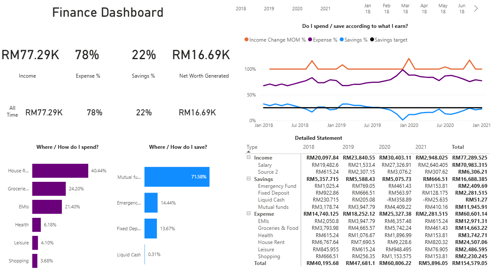

# Personal-Finance-Dashboard

This project showcases an interactive Power BI dashboard designed to help users track and manage their income, expenses, and savings more effectively. The goal was to consolidate financial data into a single, user-friendly platform that supports better budgeting and spending decisions.

📌 Project Overview --> I developed this dashboard to provide a clear visual overview of personal financial health. The dataset was taken from Youtube Channel Codebasics - https://www.youtube.com/watch?v=pqSoCa2NGj4&t=4587s. This dashboard is aimed to capture a complete picture of income streams, expense categories, and savings trends.

Key Questions
1. What is my spending and saving behaviour?
2. Do I have spend according to what I earn?
3. What is the breakdown of my income, expenses and savings?
   
🛠 Tools & Techniques Used

1. Power BI: Dashboard creation and data visualization.
2. Power Query (ETL Tool): To clean, filter and structure raw data for analysis.
3. DAX (Data Analysis Expressions) – To calculate key metrics such as:
   1. Total Income
   2. Total Expenses
   3. Net Savings

🔄 Workflow

1. Data Import & Preparation
   1. Consolidated financial data. In this project, I used dataset that are readily available but will working on my real financial dataset in future. Stay tuned!
   2. Used Power Query to remove inconsistencies, standardize formats, and structure the dataset.
2. Data Modeling & KPI Creation
   1. Designed measures in DAX for essential performance indicators.
   2. Established relationships between tables for dynamic filtering.
3. Dashboard Design
   1. Created a range of visualizations, including
      1. Bar charts for category-wise expenses.
      2. Line graphs for monthly income and savings trends.
      3. Added interactive slicers for filtering by timeframe.

📊 Key Benefits

1. Provides a visual breakdown of spending habits.
2. Tracks monthly trends for income, expenses, and savings.
3. Supports informed budgeting decisions through data-driven insights.

Learning Takeaways
1. Learnt how track expenses to analyze my spending behaviour
2. Learnt how to match spending and saving behaviour
3. Learnt the correlation between spending, saving and expenses pattern

Enhances financial awareness and helps identify opportunities to save more.

This project highlights my skills in data transformation, KPI creation, and interactive dashboard design using Power BI, and demonstrates how data analytics can be applied to everyday financial management.
